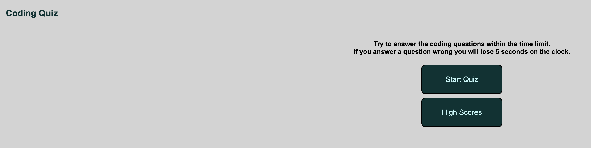

# Coding Quiz 

## Description 

The user is presented with a coding quiz front page. If the user clicks "Start Quiz" they have 75 seconds to answer 10 questions. If they answer a question wrong five seconds is removed from the clock. The users final score will be the number of questions they get right. Once the quiz is completed the user will be prompted to enter their initials to record their high score. A table will appear showing all saved high scores, sorted from the highest to the lowest. Scores will be saved to local storage until the "Clear High Scores" button is clicked. 

## Screenshots of Quiz 

